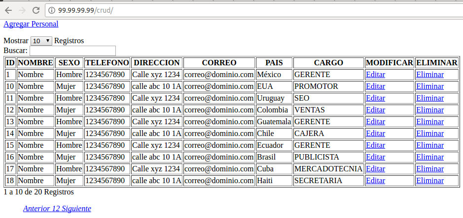

# Vagrant con un playbook de ansible para instalar:  LAMP + CRUD 100% funcional

<pre>
vagrant up

Bringing machine 'default' up with 'virtualbox' provider...
==> default: Importing base box 'ubuntu/trusty64'...
==> default: Matching MAC address for NAT networking...
==> default: Setting the name of the VM: vagrant04_default_1495112665502_60031
==> default: Clearing any previously set forwarded ports...
==> default: Clearing any previously set network interfaces...
==> default: Preparing network interfaces based on configuration...
    default: Adapter 1: nat
    default: Adapter 2: hostonly
==> default: Forwarding ports...
    default: 80 (guest) => 8081 (host) (adapter 1)
    default: 22 (guest) => 2221 (host) (adapter 1)
    default: 3306 (guest) => 33061 (host) (adapter 1)
==> default: Running 'pre-boot' VM customizations...
==> default: Booting VM...
==> default: Waiting for machine to boot. This may take a few minutes...
    default: SSH address: 127.0.0.1:2221
    default: SSH username: vagrant
    default: SSH auth method: private key
    default: Warning: Remote connection disconnect. Retrying...
==> default: Machine booted and ready!
==> default: Checking for guest additions in VM...
    default: The guest additions on this VM do not match the installed version of
    default: VirtualBox! In most cases this is fine, but in rare cases it can
    default: prevent things such as shared folders from working properly. If you see
    default: shared folder errors, please make sure the guest additions within the
    default: virtual machine match the version of VirtualBox you have installed on
    default: your host and reload your VM.
    default: 
    default: Guest Additions Version: 4.3.36
    default: VirtualBox Version: 5.0
==> default: Configuring and enabling network interfaces...
==> default: Mounting shared folders...
    default: /vagrant => /home/jprado/vagrant/vagrant04
    default: /var/www/html => /home/jprado/vagrant_public
==> default: Running provisioner: ansible...
    default: Running ansible-playbook...
[DEPRECATION WARNING]: Instead of sudo/sudo_user, use become/become_user and 
make sure become_method is 'sudo' (default). This feature will be removed in a 
future release. Deprecation warnings can be disabled by setting 
deprecation_warnings=False in ansible.cfg.

PLAY ***************************************************************************

TASK [setup] *******************************************************************
ok: [default]

TASK [paquetes_basicos : Run apt-get update] ***********************************
ok: [default]

TASK [paquetes_basicos : Install list of packages] *****************************
changed: [default] => (item=[u'vim', u'git', u'nmap', u'curl', u'wget', u'strace', u'net-tools', u'unzip', u'htop', u'iotop', u'iftop', u'mlocate', u'openssh-server'])

TASK [apache : Install apache2] ************************************************
changed: [default]

TASK [php : install PHP] *******************************************************
changed: [default] => (item=[u'php5-cli', u'php5-curl', u'php5-fpm', u'php5-intl', u'php5-json', u'php5-mcrypt', u'php-pear', u'libapache2-mod-php5', u'php5-mysql', u'php5-common'])

TASK [mysql : Install mysql server and client] *********************************
changed: [default] => (item=[u'mysql-server', u'mysql-client', u'python-mysqldb'])

TASK [mysql : Creating database datos] *****************************************
changed: [default]

TASK [mysql : mysql_user] ******************************************************
changed: [default]

TASK [mysql : locale_gen] ******************************************************
changed: [default]

TASK [software : git] **********************************************************
ok: [default]

TASK [software : Import database from a dump] **********************************
changed: [default]

PLAY RECAP *********************************************************************
default                    : ok=11   changed=8    unreachable=0    failed=0 
</pre>

# Finally the result is this

   

